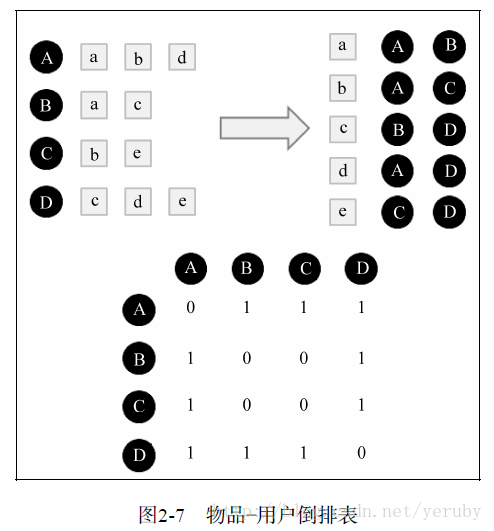

# 推荐系统实战（1）---基于用户的协同过滤
花了两个周末的时间尝试了一下基于用户相似度的协同过滤算法(userCF)，主要目的除了对这种算法加深一下理解外，还想对推荐系统的数据集划分方式、评测指标、推荐的参数选择有一些实际的了解。算法本身虽然比较简单，但是实际工程中还是有不少学问的，尤其是当推荐的用户和候选商品规模比较庞大的情况下，如何合理的构建用户相似度矩阵是这个算法最核心的问题。本文分以下几个部分谈谈我做的工作：
- **推荐数据来源描述和数据划分**
- **用户相似度矩阵构建**
- **推荐向量生成和评测指标**
- **trick和来不及填的坑**
--------------------------------
## **推荐数据来源描述及数据划分**
这次主要是测试userCF的算法效果，同时也为了有一个可以比较的结果，所以数据集采用了<推荐系统实战>上应用的Movielen电影推荐数据集。这个数据集主要包括下面几个表(按照ml-20m，其余的数据集类似)：

|        文件名        |               列名               |           描述            |
| :---------------: | :----------------------------: | :---------------------: |
|    ratings.csv    | usrId，movieId，rating，timestamp | 核心表，记录用户对各个电影打的分数和打分的时间 |
|    movies.csv     |      movieId，title，genres      |         电影名称及标签         |
|     links.csv     |     movieId，imdbId，tmdbId      |         电影Id映射表         |
| genome-scores.csv |    movieId，tagId，relevance     |      电影和各个标签的相关系数       |
|  genome-tags.csv  |           tagId，tag            |        各个标签实际的内容        |

userCF只需要用到ratings.csv，并且只需要预测用户是否会对电影评分，但是其他的表还是有很大的想象空间的（特别是标签）。数据集划分有两种方式：直接随机划分和按照时间先后顺序划分。推荐系统实战中采用前者，但是个人比较倾向于后者。因为实际推荐中构建用户相似度矩阵时是不知道后面用户会对哪些电影打分的，还有一些电影是在未来才出现的(实践证明按照时间划分评测出来的准确度会有较大的下降)。为了与书上的结果有个对比，确保我的代码没有bug，两种数据集划分我都做了，输入的initTable是用pandas读取ratings.csv得到的DataFrame。

```
def datasetSplitByTime(initTable):
    sampleData = initTable.loc[initTable['userId']<=user_num]
    timeList = sorted(sampleData['timestamp'])
    splitTime = timeList[int(len(timeList)*split_pt)]
    train = sampleData.loc[sampleData['timestamp']<=splitTime]
    test = sampleData.loc[sampleData['timestamp']>splitTime]
    return train,test
    
def datasetSplitByRandom(initTable):
    import random
    train_index = random.sample(list(initTable.index), int(len(initTable.index)*split_pt))
    test_index = list(set(initTable.index)^set(train_index))
    train = initTable.loc[train_index]
    test = initTable.loc[test_index]
    return train, test
```

## **用户相似度矩阵构建**

对于userCF而言最主要的工作就是用户之间的相似度矩阵的计算，两个用户之间的相似度通过它们所打分过电影的余弦相似度衡量，如下所示：

​	
$$
w_{uv}=\frac{|N(u)\bigcap{N(v)}|}{\sqrt{|N(u)||N(v)|}}
$$
各个用户之间的相似度矩阵的构建方式如下图所示。先分别以用户ID和电影ID为主键构建倒排列表，再对电影-用户表进行逐行遍历，在用户交集矩阵中将对同一电影打分的用户之间的用户交集加1，将每个用户看的电影数量相乘并开根号构建并集矩阵，最后将两个矩阵各项相除就得到了各个用户之间的相似度矩阵。我的构建方式相对于推荐系统实战中有所不同，没有逐个读取电影-用户倒排表中的用户组合构建交集矩阵，而使用python的numpy将同一电影向量下与某个用户相交的用户批量叠加至交集矩阵，这种批量叠加的方式使得原有的相似度矩阵构建算法复杂度由\\(O(n^3)\\)降低至\\(O(n^2)\\)，具体的代码如下所示。

```python
def getSingleInnerJoinMat(userVec):
    simMat = np.zeros((user_num+1, user_num+1))
    for i in userVec:
        #simMat[i][userVec] = 1.0/math.log(1+len(userVec))
        simMat[i][userVec] = 1.0
    return simMat

def getOuterJoinMat(userTable):
    outerJoinMat = np.ones((user_num+1, user_num+1))
    for i in userTable.index:
        outerJoinMat[i, 1:] = len(userTable[i])
    for i in userTable.index:
        #outerJoinMat[1:,i] = np.sqrt(len(userTable[i])*outerJoinMat[1:,i])
        outerJoinMat[1:,i] = len(userTable[i])*outerJoinMat[1:,i]
    outerJoinMat = np.sqrt(outerJoinMat)
    return outerJoinMat
        
def userSimilarity(userTable,movieTable):
    innerJoinMat = np.zeros((user_num+1, user_num+1))
    outerJoinMat = getOuterJoinMat(userTable)
    for i, users in movieTable.iteritems():
        print "innerJoinMat building %d, total %d" %(i, len(movieTable))
        innerJoinMat += getSingleInnerJoinMat(users)
    simMat = innerJoinMat/outerJoinMat
    np.save('./data/middleData/trainSimMat.npy',simMat)
    return simMat
```



## 推荐向量生成和评测指标

生成用户相似度矩阵后，推荐向量的生成就相对比较简单了。对任意一个用户做推荐就找出与这个用户兴趣相似度最接近的M个用户（目前取的30），对相似用户打分过的电影做差集，找出相似用户打分过而这个用户没打过分的电影，将这些电影添加到推荐候选集并根据用户相似度给这个推荐电影添加一个推荐指数，最后取出推荐指数最高的前N部电影（目前取30）作为推荐的电影参与评测，代码如下：

```python
def recommend(userId, trainUserTable, simMat): 
    rank = dict()
    userBehavior = trainUserTable[userId]
    simVec = dict(zip(range(len(simMat)), simMat[userId]))
    for i,w in sorted(simVec.items(), key=operator.itemgetter(1), reverse=True)[:K+1]:
        if i == userId:
            continue
        for j in trainUserTable[i]:
            if j not in rank:
                rank[j] = 0
            if j not in userBehavior:
                rank[j] += w
    if len(rank) < 30:
            return [i for i, _ in sorted(rank.items(), key=operator.itemgetter(1), reverse=True)]
    return [i for i, _ in sorted(rank.items(), key=operator.itemgetter(1), reverse=True)[:30]]
    
def recommendAll(trainUserTable, trainMovieTable, testUserTable):
    simMat = np.load('./data/middleData/trainSimMat.npy')
    innerLengthSum = 0
    rankLengthSum = 0
    selfLengthSum = 0
    for i in testUserTable.index[:user_num]:
        if i in trainUserTable.index:
            print "userId:%d" %(i)
            rank = recommend(i, trainUserTable, simMat)
            #rank = recommendTopK(trainMovieTable, 100)
            innerLengthSum += innerLength(rank, testUserTable[i])
            rankLengthSum += len(rank)
            selfLengthSum += len(testUserTable[i]) 
    print "innerLengthSum:%d" %(innerLengthSum)
    print "rankLengthSum:%d" %(rankLengthSum)
    print "recall=%f" %(innerLengthSum*1.0/selfLengthSum)
    print "precision=%f" %(innerLengthSum*1.0/rankLengthSum)
    
```

得到推荐向量后进一步评估推荐指标的参数主要有四个：准确率、召回率、流行度和覆盖率。具体的公式如下，准确率和召回率是主要的评估准则，用于描述推荐的精度，只是前者的分母是总推荐的电影数目，后者的分母是被推荐用户实际看的电影数目，为了防止推荐数目过多或被推荐用户评分的电影数目过少造成单一指标评估不准确才分为这两个参数；流行度用于评估被推荐的电影是否都是流行的电影（如果是那么说明推荐效果不明显），覆盖率表示推荐的电影占电影全集空间的比重，也是用来衡量推荐效果的。  
$$
precision=\frac{\sum_u|{R(u)}\bigcap{T(u)}|}{\sum_u{T(u)}}
$$

$$
recall=\frac{\sum_u|{R(u)}\bigcap{T(u)}|}{\sum_u{R(u)}}
$$

$$
coverage=\frac{|\sum_{u\in{U}}{R(u)}|}{|I|}
$$

$$
popularity=log(\sum_i{len(T(i))})
$$

## trick和来不及填的坑

冷启动

矩阵分解

用户评分数据使用

选择相似用户数、推荐数目的影响